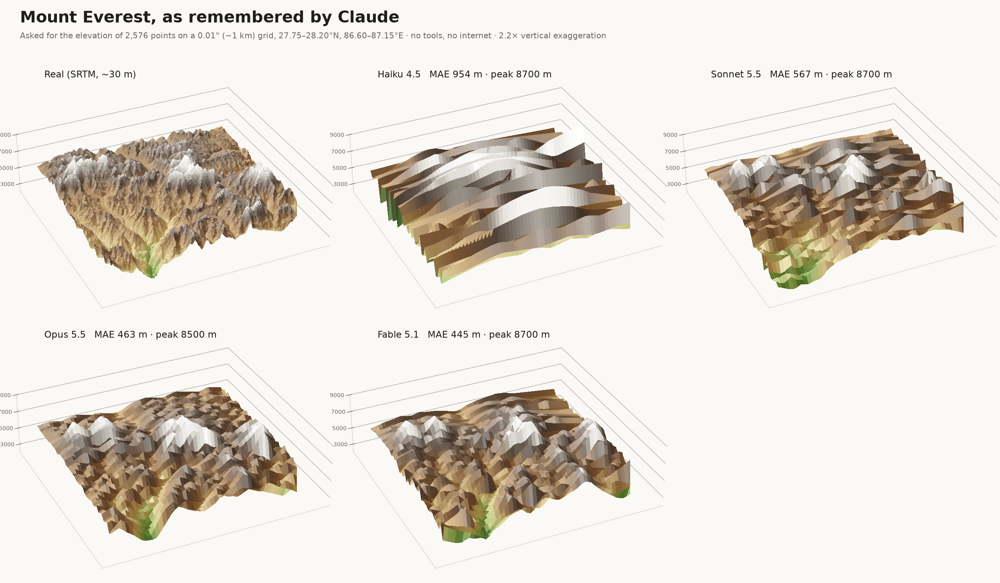
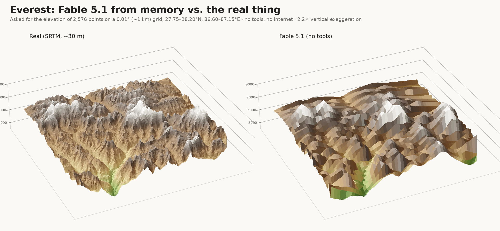
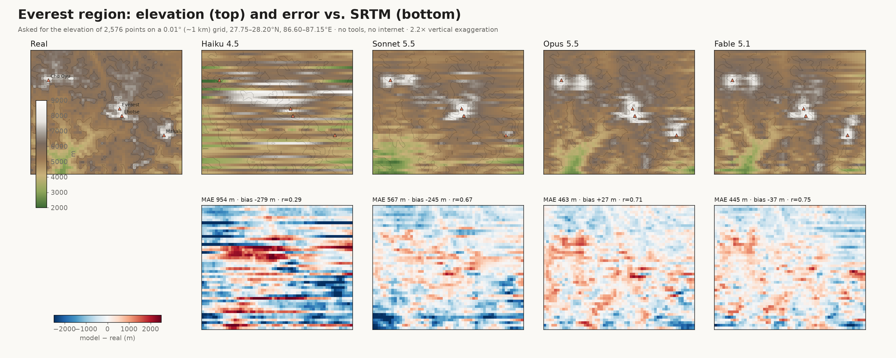
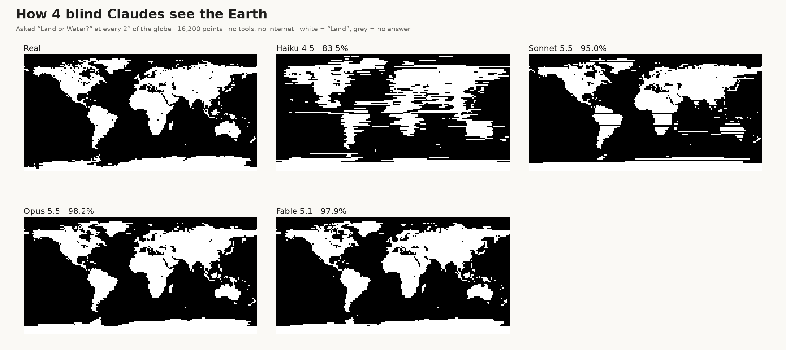
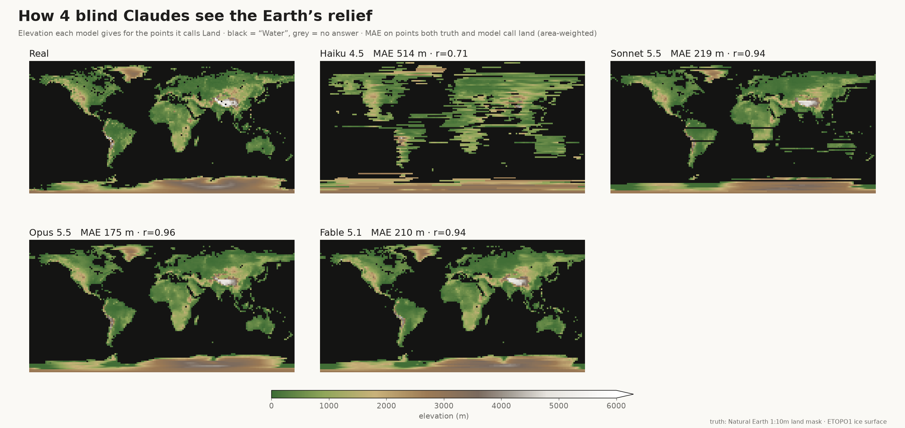
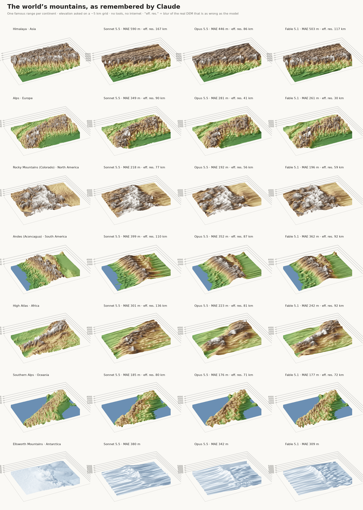
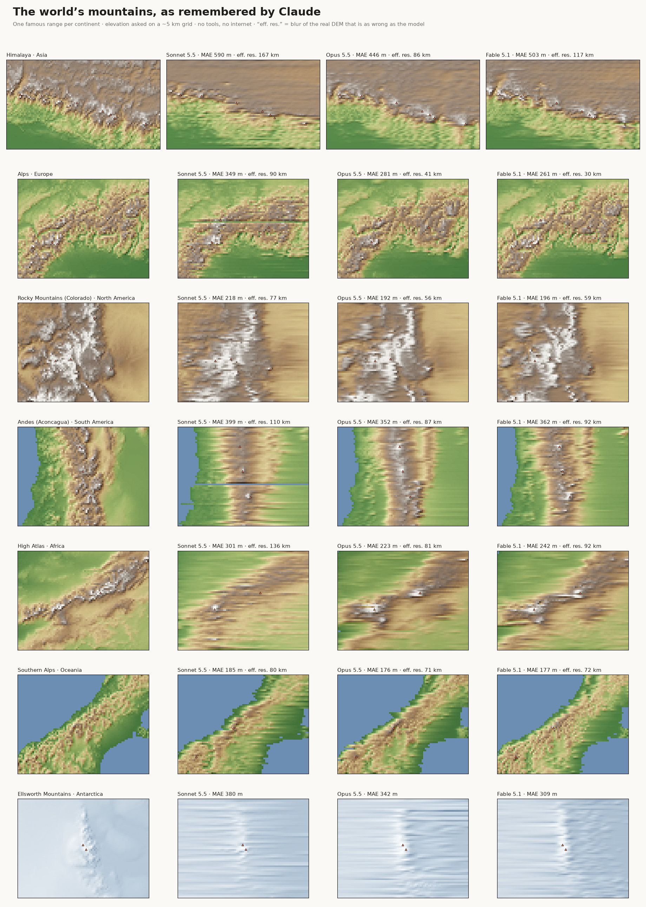
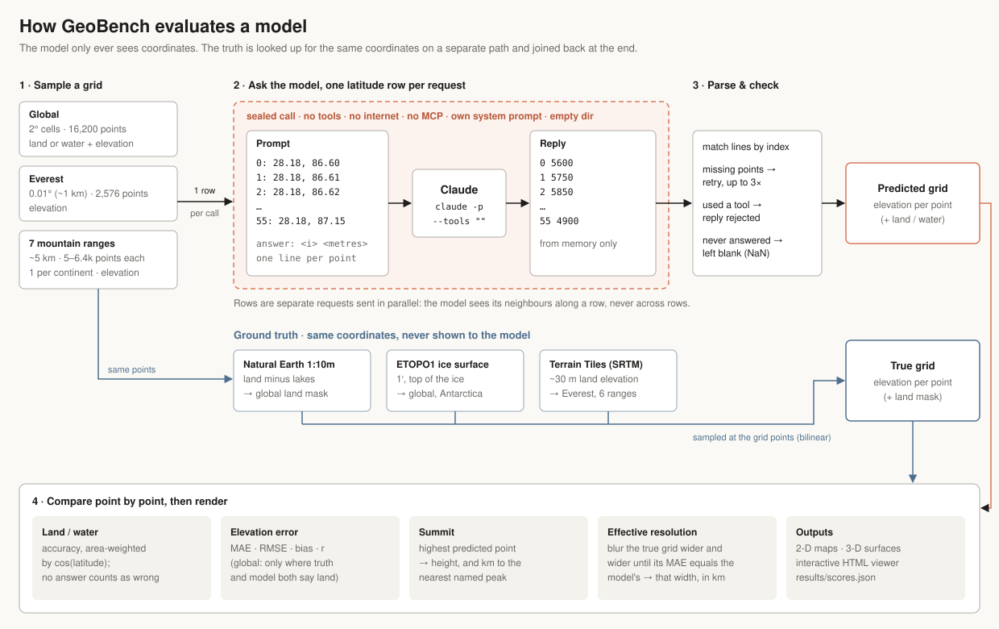

# GeoBench — how blind Claudes see the Earth (and its mountains)

A replication and extension of [@celestepoasts' "How blind Claudes see the Earth"](https://x.com/celestepoasts/status/2103232383139057950):
models are asked "Land or Water?" at every 2° of the globe **and, for land, the elevation in metres**.
A second experiment zooms in on **Mount Everest**: the model is asked for the elevation of
every point on a ~1 km grid, and its answers are rendered in 3-D next to the real terrain.

The models get **no tools, no internet, no images** — only coordinates as text.

## Results

Four current Claudes, run through the Claude Code CLI with no tools (`--backend cli`,
`--effort low` for Sonnet 5.5 / Opus 5.5 / Fable 5.1; Haiku 4.5 at defaults), 2026-10-02.

### Mount Everest, from memory







Interactive, rotatable version: [`figures/everest_3d.html`](figures/everest_3d.html).

| Model | MAE | RMSE | bias | r | highest point given | its offset from the real summit |
|---|---:|---:|---:|---:|---:|---:|
| Haiku 4.5  | 954 m | 1220 m | −279 m | 0.29 | 8700 m | 23.5 km |
| Sonnet 5.5 | 567 m |  753 m | −245 m | 0.67 | 8700 m | 1.0 km |
| Opus 5.5   | 463 m |  605 m |  +27 m | 0.71 | 8500 m | 0 km |
| Fable 5.1  | **445 m** | **581 m** | −37 m | **0.75** | 8700 m | 0 km |

(Real summit on this grid: 8392 m at 27.99°N 86.92°E. The grid point misses the actual 8849 m top by a few hundred metres.)

The three big models put Everest, Lhotse, Makalu and Cho Oyu in the right places and draw
the Khumbu/Dudh Kosi valley system in the south-west. Below that scale the terrain is
mostly invented. **How much detail do they really know?** Blurring the *real* DEM with an
N-km box filter gives:

| real DEM blurred over | 3 km | 5 km | 9 km | 13 km | 25 km |
|---|---:|---:|---:|---:|---:|
| MAE vs. unblurred | 154 m | 220 m | 295 m | 340 m | 402 m |

Even the best model (445 m) scores worse than a 25-km blur of the truth. Smoothing the
models' *own* answers over 3 km improves every one of them (Fable 445 → 387 m, Opus 463 → 408 m),
so their sub-kilometre ridges are noise. A finer grid would mostly buy more noise, at 4× the
cost per halving of the spacing.

### The whole globe: land/water and elevation





| Model | land/water accuracy | elevation MAE | RMSE | bias | r |
|---|---:|---:|---:|---:|---:|
| Haiku 4.5  | 83.5% | 514 m | 825 m | −15 m | 0.71 |
| Sonnet 5.5 | 95.0% | 219 m | 403 m | −85 m | 0.94 |
| Opus 5.5   | **98.2%** | **175 m** | **319 m** | −36 m | **0.96** |
| Fable 5.1  | 97.9% | 210 m | 390 m | −8 m | 0.94 |

Elevation is scored only where truth *and* model both say land (Haiku 4,404 points; Opus 5,250).
Every model gets the Tibetan plateau, the Andes, the Greenland and Antarctic ice domes and
the Ethiopian highlands.

**Caveat: batching artifacts.** Points are asked one latitude row at a time. Weaker models
sometimes collapse a whole row into a repeated answer: Sonnet answered "W" for all 180
points on the rows at 1°S and 19°S (Africa and South America both vanish), and Haiku's maps are
streaky for the same reason. These are real answers, but they come from the protocol. Asking point
by point (as in the original) or in shorter chunks would remove them.

Cost of this run: about $44 of usage in total (`cost_usd` in each results file).


### One famous range per continent, at ~5 km

Same idea as Everest, zoomed out: a ~400 × 300 km window (520 km for the Himalaya) per
continent, elevation asked on a ~5 km grid with square cells (sea = 0), ~5,000–6,400 points per range.
Sonnet 5.5, Opus 5.5 and Fable 5.1, `--effort low`, no tools.





Per-range close-ups are in [`figures/ranges/`](figures/ranges/), and
[`figures/ranges_3d.html`](figures/ranges_3d.html) is a rotatable 3-D viewer with a range picker.

**Error (MAE) · effective resolution** (how much the real DEM must be blurred to be as wrong
as the model; smaller = the model knows finer detail). Best MAE per range in bold.

| Range | Sonnet 5.5 | Opus 5.5 | Fable 5.1 |
|---|---:|---:|---:|
| Asia: Himalaya | 590 m · 167 km | **446 m · 86 km** | 503 m · 117 km |
| Europe: Alps | 349 m · 90 km | 281 m · 41 km | **261 m · 30 km** |
| North America: Rocky Mountains (Colorado) | 218 m · 77 km | **192 m · 56 km** | 196 m · 59 km |
| South America: Andes (Aconcagua) | 399 m · 110 km | **352 m · 87 km** | 362 m · 92 km |
| Africa: High Atlas | 301 m · 136 km | **223 m · 81 km** | 242 m · 92 km |
| Oceania: Southern Alps | 185 m · 80 km | **176 m · 71 km** | 177 m · 72 km |
| Antarctica: Ellsworth Mountains | 380 m · >300 km | 342 m · >300 km | **309 m · >300 km** |

**Highest point each model gives** (the 5-km grid misses true summits, so "real" is lower than the peak heights you know):

| Range | real top on grid | Sonnet 5.5 | Opus 5.5 | Fable 5.1 |
|---|---:|---|---|---|
| Himalaya | 7689 m | 8000 m, 1 km from Everest | 8300 m, 1 km from Everest | 8100 m, 34 km from Annapurna |
| Alps | 4094 m | 4300 m, 16 km from Monte Rosa | 3800 m, 1 km from Monte Rosa | 4200 m, 1 km from Monte Rosa |
| Rocky Mountains | 4203 m | 4200 m, 7 km from Mt Elbert | 4000 m, 35 km from Mt Elbert | 4200 m, 10 km from Mt Elbert |
| Andes | 6319 m | 6000 m, 2 km from Aconcagua | 6200 m, 4 km from Aconcagua | 6200 m, 4 km from Mercedario |
| High Atlas | 3700 m | 3900 m, 3 km from Toubkal | 3700 m, 3 km from Toubkal | 3800 m, 3 km from Toubkal |
| Southern Alps | 2726 m | 3000 m, 1 km from Aoraki | 2900 m, 1 km from Aoraki | 3400 m, 1 km from Aoraki |
| Ellsworth Mountains | 4708 m | 4500 m, 4 km from Vinson | 4500 m, 2 km from Mt Tyree | 4300 m, 8 km from Vinson |

What stands out:

* **The large-scale shape is right everywhere.** Each model draws the Tibetan plateau and the Himalayan
  front dropping to the Ganges plain, the arc of the Alps around the Po plain, the Front Range against the
  Great Plains, the Andes between the Pacific and the Pampas, the High Atlas spine, the South Island
  coastline, and the Sentinel Range ridge rising out of the ice.
* **The famous summits are in the right place.** Most models put their highest point within a few km
  of the peak you'd name. A model gives the same top value at several points, so "nearest peak"
  just follows whichever of those comes first (e.g. Fable's Himalayan 8100 m point near Annapurna).
* **Detail below ~30–90 km is mostly invented.** Effective resolution is best in the Alps
  (Fable 30 km, Opus 41 km), the most heavily documented range. It is worst in the Himalaya and the
  Atlas, where models draw plausible-looking but wrong ridges.
* **Opus 5.5 is best on 5 of 7 ranges.** Fable 5.1 wins in the Alps and Antarctica at about 3.5× the cost.
* **Antarctica's effective resolution isn't meaningful.** The truth there is ETOPO1's smooth ice
  surface (Terrain Tiles have bedrock under ice), and even a 300 km blur of it stays closer than
  any model.
* The row-batching streaks are visible again (e.g. Sonnet's dark line across the Andes).

Cost of the range runs: about $86 (Fable $59, Opus $17, Sonnet $10).

## How it works



| | Global | Everest |
|---|---|---|
| Grid | 2° cell centres, 90 × 180 = 16,200 points | 0.01° (~1 km), 27.75–28.20°N × 86.60–87.15°E, 46 × 56 = 2,576 points |
| Question | Land or Water? If land, elevation (m) | Elevation (m) |
| Truth | Natural Earth 1:10m land minus lakes; elevation from ETOPO1 ice surface | AWS Terrain Tiles z12 (SRTM ~30 m) |
| Metric | area-weighted (cos lat) land accuracy; elevation MAE/RMSE/r on points both truth and model call land | MAE, RMSE, bias, r; height & position of the predicted summit |

* **Batched by row.** Each request holds one latitude row (180 points global, 56 points
  Everest), each point indexed so answers are matched even if one is skipped. Unanswered
  points count as wrong (global) / are left as holes (Everest). The original asked point by point;
  batching cuts the number of calls ~100×, but lets a model see its neighbours *within a row*
  (not across rows — you can see the row-wise "streaks" in weaker models' Everest surfaces).
* **No internet.** `--backend api` calls the Messages API with no `tools`. `--backend cli`
  runs `claude -p` with `--tools ""`, `--strict-mcp-config`, `--setting-sources ""`, our own
  system prompt, in an empty temp dir, and rejects any reply that took more than one turn.
* Prompts are in [`geobench/prompts.py`](geobench/prompts.py).

## Reproduce

```bash
pip install -r requirements.txt
export ANTHROPIC_API_KEY=...                 # or use --backend cli with a logged-in Claude Code
python -m geobench.run --grid everest --model claude-opus-5-5 --backend api
python -m geobench.run --grid global  --model claude-opus-5-5 --backend api --workers 16
python -m geobench.run --grid alps    --model claude-opus-5-5 --backend api   # or himalaya, rockies, andes,
                                                                             # atlas, southern_alps, ellsworth
python -m geobench.render                    # -> figures/*.png, figures/everest_3d.html, results/scores.json
```

Runs are resumable (`results/<grid>/<model>.jsonl` holds every raw reply). Add models to
`MODELS` in `geobench/render.py` to include them in the figures.
